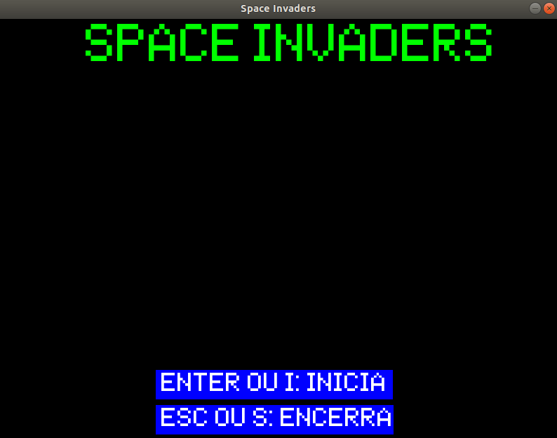

# SPACE INVADERS 🛸

**ALIENS ESTÃO INVADINDO A TERRA! :alien:**

Calma, essa é apenas a temática que o jogo Space Invaders segue!  
Sendo originalmente lançado em 1978 pela [TAITO CORPORATION](https://www.taito.com/) e desenhado por Tomohiro Nishikado, posteriormente foi licenciado pela Midway. Este joguinho foi um dos primeiros da temática de tiro com gráfico bidimensional e que até hoje faz sucesso.  

O objetivo do jogo é destruir os aliens com a sua nave e dessa forma impedir que a invasão se concretize. Porém, não se pode dormir na direção, já que a qualquer momento os aliens podem te atingir e conseguir o que tanto querem: conquistar a Terra 🌎!

## Tópicos

1. [Eventos essenciais em um jogo](#eventos-essenciais-em-um-jogo)
2. [Pygame](#pygame-)
3. [Instalação Pygame](#instalando-o-pygame)
4. [Executar o jogo](#instalando-o-pygame)
5. [Links úteis para aprender Pygame](#links-úteis)

### Eventos Essenciais em um jogo

Para se construir um jogo é necessário ter conhecimento de quais eventos são importantes para se construir um jogo. Portanto, abaixo temos uma tabela com alguns desses eventos:

|        Eventos                   |                           Explicação                                                 |
|:--------------------------------:|:------------------------------------------------------------------------------------:|
|               Surface            |são as superfícies em 2D ou 3D onde se desenha o jogo, podendo preencher uma área com ||                                  |  uma cor ou mudar a cor da superfície dependendo da posição, e outros recursos como  ||                                  |   transparência.                                                                     |
|               Display            |é o eventos para manipulação da tela do jogo, podendo atualizar o conteúdo da tela,   ||                                  |  retornar a superfície que representa a tela ou configurar o tamanho da tela.        |
|               draw               |                 são os desenhos na superfície.                                       |
|               image              |        são as imagens, podendo ler ou gravar as imagens.                             |
|               event              |                    são os eventos do jogo.                                           |
|               font               |                 utilizado para trabalhar com fontes.                                 |
|               transform          |        pode rotacionar, espelhar, modificar ou cortar as superfícies do jogo.        |
|               mixer              |                     trabalha com com os sons do jogo.                                |
|               Clock              |                     trabalha com o tempo dos quadros do jogo.                        |
|               sprite             |é uma imagem bi-dimensional que faz parte de uma cena maior, isto                     ||                                  |é, os componentes que aparecem no jogo. Podendo se dividir em Sprite e Group, a classe||                                  |Group serve para agrupar vários Sprites.                                             |

### Pygame 🐍

PyGame é um módulo<sup>[1](#footnote-1)</sup> usado na programação de jogos 2D, escrito utilizando C e Python. Ele pode ser executado em todas as principais plataformas e fornece ferramentas simples para gerenciar ambientes gráficos complexos, com movimentos e sons.  
Alguns módulos presentes em pygame são:  


|            Módulo                |               Funcionalidade                                    |
|:--------------------------------:|:---------------------------------------------------------------:|
|               cursors            |            carrega imagens de cursores como mouse.              |
|               display            |             controla a exibição da janela ou tela.              |
|                draw              |           desenha formas simpFuncionalidadeles sobre uma Surface.             |
|                event             |              controla eventos e fila de eventos.                |
|                font              |                    cria e renderiza fontes.                     |
|                image             |                    salva e carrega imagens.                     |
|              joystick            |             controla dispositivos joystick.                     |
|                 key              |                       controla o teclado.                       |
|                locals            |                contém constantes de Pygame.                     |
|                mixer             |                     carrega e executa sons.                     |
|                mouse             |                       controla o mouse.                         |
|               movie              |                executa filmes no formato mpeg.                  |
|                time              |                     controla a temporização.                    |
|             transform            |    permite redimensionar e mudar a orientação de imagens.       |
|               cdrom              |    gerencia o dispositivo de cdrom e a execução do áudio.       |
|              sndarray            |                    manipula sons com NumPy.                     |
|             surfarray            |                   manipula imagens com NumPy.                   |


FONTE: [LINK](http://www.labtime.ufg.br/cgames/pdf/CProgPy_Pygame.pdf)

### Instalando o Pygame

Inicialmente é necessário ter o Python instalado e o pip. Caso não tenha um dos dois instalados siga o passo a passo visto [aqui para Linux](https://python.org.br/instalacao-linux/) ou [aqui para Windows](https://python.org.br/instalacao-windows/).

1. Para iniciar a instalação do Pygame, é recomendável estar com o pip atualizado, para isso faça _(esse passo pode ser pulado se você acabou de instalar o pip)_:

```
$ pip install --user --upgrade pip 
```

2. Instalando Pygame:

```
$ pip install --user pygame
```

### Executando o jogo

Qualquer um pode baixar o código do jogo e executar clicando no botão verde **Clone or download** e pode baixar o código clicando em **Download ZIP** ou digitando no terminal o comando:

```
$ git clone https://github.com/HigorSnt/SpaceInvaders.git
```

> Se optar pela primeira opção lembre-se de extrair!

Em seguida, entre na pasta do jogo utilizando o terminal:

```
$ cd SpaceInvaders
```

Por fim, faça o seguinte comando:

```
$ python game.py
```

Em seguida deverá abrir a janela do jogo 😁

<p align="center">
    
</p>

### Links Úteis

* [Apresentação feita em sala de aula]()
* [A documentação oficial do Pygame é muito fácil de ser utilizada!](https://www.pygame.org/docs/)
* [Esse material do curso realizado pela UFG!](http://www.labtime.ufg.br/cgames/pdf/CProgPy_Pygame.pdf)
* [Repositório do Pygame no Github](https://github.com/pygame/pygame)
* [Material: Programação em Python e Introdução ao Pygame](http://www.dainf.ct.utfpr.edu.br/petcoce/wp-content/uploads/2013/09/document.pdf)
* Dúvidas com Python Orientado à Objetos?
    * [Matéria da página Medium que pode ajudar](https://medium.com/@nicolasbontempo/programando-python-orientado-a-objetos-d0069b2f1eb5)
    * [Material da UNESP - Campus de Ilha Solteira](https://www.dcc.ufrj.br/~fabiom/mab225/pythonoo.pdf)

_________________________________________________
1. <a name="footnote-1"></a> Módulos são arquivo que contêm definições e instruções de Python, ou seja, qualquer arquivo _.py_ é um módulo!